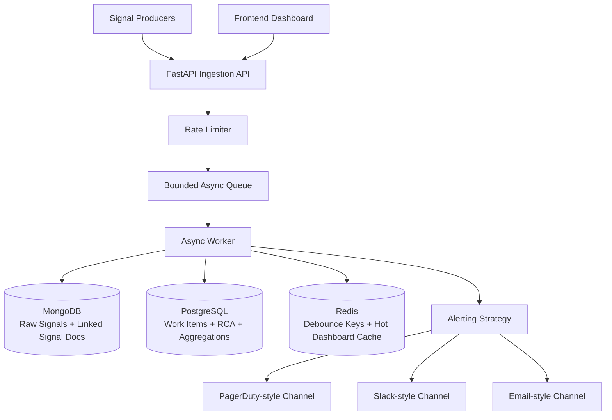

# Incident Management System (IMS)

A resilient Incident Management System for high-volume signal ingestion, workflow-driven incident handling, and mandatory RCA closure.

## Architecture Diagram

## Tech Stack Choices
- **Backend**: FastAPI + asyncio (high throughput, async-first)
- **Source of Truth**: PostgreSQL (transactional status + RCA)
- **Data Lake / Raw signals (NoSQL)**: MongoDB
- **Hot Path Cache**: Redis
- **UI**: Responsive HTML/JS dashboard in `/frontend`
- **Packaging**: Docker Compose for one-command startup

## Key Requirements Mapping
- Async processing: ingestion queue + worker.
- Burst handling: bounded queue, retry/requeue, non-blocking API.
- Debouncing: one work item per component in 10s window, all signals still stored/linked in MongoDB.
- Strategy pattern: alert channel chosen by severity.
- State pattern: OPEN -> INVESTIGATING -> RESOLVED -> CLOSED transitions enforced.
- Mandatory RCA: transition to CLOSED rejected unless RCA complete.
- MTTR: auto computed from `incident_start` and `incident_end`.
- Observability: `/health` endpoint + throughput logs every 5 seconds.

## Run Locally (Docker Compose)
1. Ensure Docker Desktop is running.
2. From repo root:
   - `docker compose up --build`
3. Access:
   - Backend API: `http://localhost:8000`
   - Health: `http://localhost:8000/health`
   - Frontend Dashboard: `http://localhost:8081`

## Run Unit Tests
From `backend`:
- `pip install -r requirements.txt`
- `pytest -q`

## Sample Data / Failure Simulation
- Sample payloads: `sample_signals.json`
- Load script: `scripts/simulate_signals.py`

Run after stack is up:
- `python scripts/simulate_signals.py`

This simulates bursty failures, including RDBMS and MCP errors.

## API Endpoints
- `POST /ingest`
- `GET /incidents` (active incidents only)
- `GET /incidents?only_closed=true` (closed incidents only)
- `GET /incidents/{id}`
- `PATCH /incidents/{id}/status`
- `PUT /incidents/{id}/rca`
- `GET /metrics/aggregations?limit=20`
- `GET /health`

## Concurrency & Race Condition Handling
- `POST /ingest` is non-blocking; work is handed off to a bounded `asyncio.Queue`, decoupling request threads from sink latency.
- Each queue consumer processes one signal at a time in its coroutine, which gives deterministic per-worker execution and simplifies shared state handling.
- Redis debounce key (`debounce:{component_id}` with TTL) uses an atomic `SET NX` “PENDING” token to prevent duplicate work-item creation even with multiple workers.
- Work item state change and RCA checks execute in one PostgreSQL transaction (`SELECT + validate + UPDATE + COMMIT`) to avoid partial writes.
- RCA upsert is transactional, so MTTR and RCA fields are committed atomically.
- Status updates are race-safe at application level because each update is evaluated and persisted as a single DB transaction unit.

## Backpressure Handling
- Ingestion uses a fixed-capacity `asyncio.Queue` (`queue_max_size`) as an in-memory pressure buffer.
- When queue capacity is exhausted, API fails fast with `503 Backpressure active`, protecting the process from unbounded growth.
- Bounded buffering prevents memory exhaustion during sink slowdowns or temporary downstream contention.
- Worker retry path catches transient write failures, sleeps briefly, and re-queues the same signal.
- Ingress rate limiter (`429`) adds a second protection layer against cascading overload.

**Load Handling Justification:** The design supports high burst traffic conceptually (10k signals/sec) by separating fast ingress from slower persistence with async buffering, backpressure, and retry semantics. Instead of crashing under spikes, the system degrades gracefully by shedding load (`429/503`) while preserving service health.

## Alerting Strategy Pattern
- Severity is computed from component type (e.g., `RDBMS -> P0`, `CACHE -> P2`).
- Strategy factory maps severity to alert channel implementation at runtime.
- This keeps alerting extensible: adding PagerDuty/Webhook/SMS channels requires a new strategy class, not core workflow rewrites.

## Resilience & Performance Additions (Bonus)
- Rate limiting on ingest API.
- Bounded in-memory queue to protect process memory.
- Isolated data sinks by purpose (raw, transactional, cache, aggregation).
- Health endpoint for readiness monitoring.
- Throughput metric logging (`signals/sec`) every 5 seconds.
- CORS support for frontend integration.

### Retry Strategy
- Worker catches persistence exceptions during signal processing.
- Failed signal is re-enqueued after a short delay (`sleep(0.2)`), creating lightweight retry behavior.
- Retry is local and fast, intended for transient sink issues (brief DB hiccups, network jitter).
- This preserves data flow continuity without blocking ingestion threads.

## Design Decisions & Trade-offs
- **MongoDB for raw signals:** high write throughput and schema flexibility for heterogeneous payloads.
- **PostgreSQL for work items/RCA:** ACID transactions for lifecycle correctness and mandatory RCA enforcement.
- **Redis for hot path:** low-latency key/value reads for debounce and dashboard state.
- **Async queue decoupling:** ingestion remains responsive while persistence catches up.
- **Trade-off:** raw signal persistence and dashboard counters are eventually consistent under burst conditions; incident lifecycle state in PostgreSQL remains strongly consistent.

## Scalability Considerations
- Ingestion API is stateless and horizontally scalable behind a load balancer.
- Queue-worker model can scale by adding consumers; for production scale, queue can be externalized to Kafka/RabbitMQ.
- Redis, MongoDB, and PostgreSQL can be scaled independently based on workload profile.
- Read-heavy dashboard traffic is offloaded via Redis hot-path caching.
- Alerting strategies are pluggable, enabling independent scaling/ownership of notification channels.
- Aggregation endpoint supports lightweight trend export without scanning raw signal documents.

## Proof of Execution
- **Health response example:** `{"status":"ok","mongo":true,"redis":true,"postgres":true}`
- **Ingestion response example:** `{"accepted":true,"queued_at":"...","queue_depth":123}`
- **Incident response example:** `{"id":2,"component_id":"RDBMS_PRIMARY_01","severity":"P0","status":"OPEN","signal_count":153,...}`
- **Dashboard proof:** Frontend at `http://localhost:8081` shows live incidents, detail view, RCA form, and status progression.

## Repository Layout
- `/backend` - API, worker, workflow logic, tests
- `/frontend` - responsive incident dashboard
- `docker-compose.yml` - local multi-service stack
- `sample_signals.json` - mock failure events
- `scripts/simulate_signals.py` - burst signal generator
- `PROMPTS_AND_PLAN.md` - prompts/spec/plans used

## GitHub & Submission
After pushing this repository, include the GitHub URL in your submission PDF named:

`AMAN LODHA - Infrastructure / SRE Intern Assignment.pdf`
